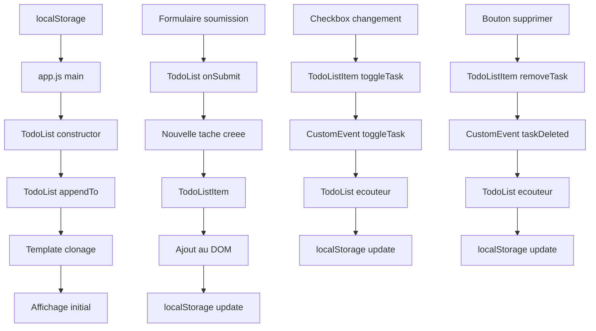

# 📝 TodoList JavaScript - Architecture et Guide Complet

## 🎯 Objectif du Projet

Ce projet est une application TodoList moderne développée en JavaScript vanilla, conçue pour démontrer les meilleures pratiques de développement frontend, l'utilisation des templates HTML, la manipulation du DOM, et la gestion des données locales.

---

## 📁 Structure du Projet

```
TodoList with Javascript/
├── 📄 index.html              # Page principale avec templates HTML
├── 📄 app.js                  # Point d'entrée et logique principale
├── 📁 components/
│   └── 📄 TodoList.js         # Composant principal TodoList
├── 📁 css/
│   └── 📄 main.css            # Styles et variables CSS
├── 📁 data/
│   └── 📄 data.json           # Données d'exemple (non utilisées)
├── 📁 functions/
│   ├── 📄 api.js              # Fonctions utilitaires API
│   └── 📄 dom.js              # Fonctions utilitaires DOM
└── 📄 README.md               # Documentation (ce fichier)
```

---

## 🏗️ Architecture Globale

### 🔄 Workflow des Données



### 🎨 Pattern Architectural

Ce projet utilise un **pattern de composants modulaires** avec :

- **Séparation des responsabilités** : Chaque fichier a une fonction claire
- **Encapsulation** : Classes avec propriétés privées (`#`)
- **Communication par événements** : CustomEvents pour le découplage
- **Templates HTML** : Séparation structure/logique

---

## 📄 Analyse Détaillée des Fichiers

### 🏠 `index.html` - Structure et Templates

#### 🎯 Rôle Principal
Point d'entrée de l'application, contient la structure HTML de base et les **templates**.

#### 🔍 Concepts Clés

**Templates HTML (`<template>`)** :
- **Quoi ?** : Fragments HTML inertes qui peuvent être clonés dynamiquement
- **Pourquoi ?** : Séparation structure/logique, réutilisabilité, performance
- **Comment ?** : Via `document.getElementById(id).content.cloneNode(true)`

```html
<!-- Template principal de l'interface -->
<template id="todolist-layout">
    <form>...</form>
    <main>
        <div class="btn-group">...</div>
        <ul class="task-group"></ul>
    </main>
</template>

<!-- Template pour chaque item de tâche -->
<template id="todolist-item">
    <li>
        <input type="checkbox">
        <label class="task-details"></label>
        <label class="btn-delete">supprimer</label>
    </li>
</template>
```

#### ⚡ Avantages des Templates
- **Performance** : Pas de parsing HTML répété
- **Maintenabilité** : Structure centralisée
- **Réutilisabilité** : Templates réutilisables
- **Séparation** : HTML séparé de la logique JavaScript

#### 🚫 Limites
- **Staticité** : Templates non dynamiques au chargement
- **Complexité** : Moins intuitif que JSX pour les débutants

---

### ⚙️ `app.js` - Point d'Entrée

#### 🎯 Rôle Principal
Initialiser l'application, gérer les erreurs, et coordonner le démarrage.

#### 🔍 Concepts Clés

**Modules ES6** :
```javascript
import { createElement } from "./functions/dom.js";
import { fetchJSON } from "./functions/api.js";
import { TodoList } from "./components/TodoList.js";
```

**Gestion des Données** :
```javascript
// Priorité : localStorage > fichier JSON > tableau vide
const todosInStorage = localStorage.getItem('todos')?.toString()
let todos = []
if (todosInStorage) {
    todos = JSON.parse(todosInStorage)
}
```

#### 🔄 Workflow d'Initialisation
1. **Importation** des modules nécessaires
2. **Récupération** des données depuis localStorage
3. **Création** de l'instance TodoList
4. **Insertion** dans le DOM
5. **Gestion** des erreurs avec affichage utilisateur

#### 🛡️ Gestion d'Erreurs
```javascript
catch(e) {
    const alertServeur = createElement('div', {
        class : 'alert-serveur',
        role : 'alert'
    })
    alertServeur.innerText = 'Impossible de charger les taches'
    document.body.append(alertServeur)
    console.error(e)
}
```

---

### 🧩 `components/TodoList.js` - Cœur de l'Application

#### 🎯 Rôle Principal
Composant principal gérant la logique métier, l'affichage et les interactions.

#### 🔍 Concepts Clés

**Classes ES6 avec Propriétés Privées** :
```javascript
export class TodoList {
    #listElement = []  // Élément DOM privé
    #todos = []        // Données privées
    
    constructor(todos) {
        this.#todos = todos
    }
}
```

**CustomEvents pour Communication** :
```javascript
// Émission d'événement personnalisé
const event = new CustomEvent('taskDeleted', {
    detail: this.#todo,
    bubbles: true,
    cancelable: true
})
this.#element.dispatchEvent(event)
```

#### 🏗️ Architecture Interne

**TodoList (Classe Principale)** :
- **Responsabilités** : Gestion globale, filtres, persistance
- **Méthodes clés** : `appendTo()`, `onSubmit()`, `toggleFilter()`, `onUpdate()`

**TodoListItem (Classe Interne)** :
- **Responsabilités** : Gestion individuelle des tâches
- **Méthodes clés** : `removeTask()`, `toggleTask()`

#### 🔄 Cycle de Vie

1. **Construction** : `new TodoList(todos)`
2. **Insertion DOM** : `appendTo(element)`
3. **Écoute Événements** : Formulaire, filtres, tâches
4. **Mise à Jour** : `onUpdate()` → localStorage

#### 🎨 Pattern Observer
```javascript
// Écoute des événements des enfants
this.#listElement.addEventListener('taskDeleted', ({detail: todo}) => {
    this.#todos = this.#todos.filter(task => task !== todo)
    this.onUpdate()
})
```

---

### 🎨 `css/main.css` - Styles et Design

#### 🎯 Rôle Principal
Styliser l'interface avec CSS moderne et variables personnalisées.

#### 🔍 Concepts Clés

**Variables CSS** :
```css
:root {
    --clr-bleu : #1877F2;
    --clr-rouge : #EF4444;
    --clr-rouge-clair : #ef44445e;
}
```

**Flexbox Layout** :
```css
.flexed {
    display: flex;
    justify-content: center;
    align-items: center;
}
```

**États Visuels** :
```css
.hide-completed .is-completed {
    display: none !important;
}

.hide-todo li:not(.is-completed) {
    display: none !important;
}
```

#### 🎯 Stratégie de Filtrage
Le CSS gère l'affichage/masquage via classes :
- `.hide-completed` : Masque les tâches complétées
- `.hide-todo` : Masque les tâches à faire
- `.is-completed` : État visuel d'une tâche complétée

---

### 🛠️ `functions/dom.js` - Utilitaires DOM

#### 🎯 Rôle Principal
Fournir des fonctions utilitaires pour la manipulation du DOM.

#### 🔍 Concepts Clés

**createElement()** :
```javascript
export function createElement(tagName, attributes = {}) {
    const element = document.createElement(tagName)
    for (const [attribute, value] of Object.entries(attributes)) {
        if (value !== false && value !== null) {
            element.setAttribute(attribute, value)
        }
    }
    return element
}
```

**CloneTemplate()** :
```javascript
export function CloneTemplate(id) {
    return document.getElementById(id).content.cloneNode(true)
}
```

#### 💡 Pourquoi ces Utilitaires ?
- **Réutilisabilité** : Fonctions réutilisables partout
- **Sécurité** : Gestion des attributs null/false
- **Performance** : Clonage de templates optimisé
- **Maintenabilité** : Code centralisé et testable

---

### 🌐 `functions/api.js` - Utilitaires API

#### 🎯 Rôle Principal
Gérer les communications avec des APIs externes.

#### 🔍 Concepts Clés

**fetchJSON()** :
```javascript
export async function fetchJSON(url, options = {}) {
    const header = {Acceptation: 'application/JSOn', ...options}
    const r = await fetch(url, header)
    if (r.ok) {
        return r.json()
    }
    throw new Error('Erreur serveur', {cause: e})
}
```

#### 📝 Note Importante
Ce fichier est **préparé pour l'avenir** mais actuellement non utilisé dans l'application. Il démontre comment intégrer des APIs externes.

---

### 📊 `data/data.json` - Données d'Exemple

#### 🎯 Rôle Principal
Fournir des données de test pour le développement.

#### 📋 Structure des Données
```json
[
  {
    "userId": 1,
    "id": 1,
    "title": "Buy groceries",
    "completed": false
  }
]
```

#### 🔍 Observations
- **Format** : JSON standard avec propriétés TodoList
- **Non utilisé** : Le projet préfère localStorage pour la persistance
- **Référence** : Structure de données attendue par l'application

---

## 🔄 Workflow des Données Complet

### 📥 Initialisation
1. **Chargement** : `localStorage.getItem('todos')`
2. **Parsing** : `JSON.parse()` si données existent
3. **Fallback** : Tableau vide si aucune donnée
4. **Instanciation** : `new TodoList(todos)`

### ➕ Création de Tâche
1. **Formulaire** : Soumission → `onSubmit()`
2. **Validation** : Titre non vide
3. **Création** : Objet Todo avec `Date.now()` pour ID
4. **Affichage** : `new TodoListItem(todo)` → DOM
5. **Persistance** : `localStorage.setItem()`

### ✅ Modification de Tâche
1. **Action** : Checkbox change → `toggleTask()`
2. **Événement** : `CustomEvent('toggleTask')`
3. **Mise à jour** : `todo.completed = !todo.completed`
4. **Persistance** : `localStorage.setItem()`

### 🗑️ Suppression de Tâche
1. **Action** : Bouton supprimer → `removeTask()`
2. **Événement** : `CustomEvent('taskDeleted')`
3. **Filtrage** : `this.#todos.filter(task => task !== todo)`
4. **Persistance** : `localStorage.setItem()`

---

## 🎯 Concepts Techniques Approfondis

### 🔐 Encapsulation avec Propriétés Privées

```javascript
class TodoList {
    #listElement = []  // Privé - inaccessible depuis l'extérieur
    #todos = []        // Privé - protège les données
    
    // Getter public si nécessaire
    get todos() {
        return [...this.#todos] // Copie pour immutabilité
    }
}
```

**Pourquoi ?**
- **Sécurité** : Protège l'état interne
- **Contrôle** : Accès contrôlé aux données
- **Maintenabilité** : Réduit les effets de bord

### 📡 Communication par CustomEvents

```javascript
// Émission
const event = new CustomEvent('taskDeleted', {
    detail: this.#todo,
    bubbles: true,      // Propage vers les parents
    cancelable: true    // Peut être annulé
})
this.#element.dispatchEvent(event)

// Écoute
this.#listElement.addEventListener('taskDeleted', ({detail: todo}) => {
    // Traitement
})
```

**Avantages**
- **Découplage** : Composants indépendants
- **Flexibilité** : Plusieurs écouteurs possibles
- **Standard** : API DOM native

### 🎨 Templates HTML vs JSX

| Templates HTML | JSX |
|---|---|
| ✅ Standard natif | ❌ Requiert transpilation |
| ✅ Séparation fichiers | ❌ Mélangé avec JS |
| ✅ Compatible tous navigateurs | ❌ Nécessite build |
| ❌ Moins dynamique | ✅ Plus expressif |
| ❌ Verbose | ✅ Concis |

### 💾 localStorage : Avantages et Limites

**Avantages**
- ✅ **Persistance locale** : Données conservées
- ✅ **Synchrone** : Simple à utiliser
- ✅ **5MB** : Espace suffisant pour petites apps
- ✅ **Accessible** : API simple

**Limites**
- ❌ **5MB maximum** : Pas pour grosses données
- ❌ **String only** : Sérialisation nécessaire
- ❌ **Synchrone** : Bloque le thread principal
- ❌ **Non sécurisé** : Accessible par JS

```javascript
// Bonne pratique dans le code
onUpdate() {
    localStorage.setItem('todos', JSON.stringify(this.#todos))
    // Note : 5MB maximum - documenté dans le code
}
```

---

## 🚀 Bonnes Pratiques Implémentées

### 📦 Modularité
- **Modules ES6** : Import/export explicites
- **Séparation fichiers** : Logique par responsabilité
- **Réutilisabilité** : Fonctions utilitaires

### 🛡️ Robustesse
- **Gestion erreurs** : Try/catch avec feedback utilisateur
- **Validation** : Input utilisateur vérifié
- **Fallbacks** : Alternatives si données manquantes

### 🎯 Performance
- **Templates** : Clonage vs création
- **Event delegation** : Écouteurs optimisés
- **CSS variables** : Styles efficaces

### 📝 Maintenabilité
- **Commentaires JSDoc** : Documentation du code
- **Noms explicites** : Fonctions et variables claires
- **Structure logique** : Organisation cohérente

---

## 🔧 Extensions Possibles

### 🌐 API Integration
```javascript
// Utilisation de api.js
const todos = await fetchJSON('https://api.example.com/todos')
```

### 🎨 Thèmes
```css
/* Variables CSS pour thèmes */
[data-theme="dark"] {
    --clr-bleu: #4A90E2;
    --clr-rouge: #E74C3C;
}
```

### 📱 Responsive Design
```css
@media (max-width: 768px) {
    .container {
        width: 95%;
        padding: 10px;
    }
}
```

### 🔍 Recherche
```javascript
searchTasks(query) {
    return this.#todos.filter(todo => 
        todo.title.toLowerCase().includes(query.toLowerCase())
    )
}
```

### 📊 Statistiques
```javascript
getStats() {
    return {
        total: this.#todos.length,
        completed: this.#todos.filter(t => t.completed).length,
        pending: this.#todos.filter(t => !t.completed).length
    }
}
```

---

## 🎓 Concepts à Approfondir

### 🔄 Event Loop et Asynchrone
- **Promesses** : Gestion opérations asynchrones
- **Async/await** : Syntaxe moderne
- **Event Loop** : Compréhension mécanisme JS

### 🎯 Design Patterns
- **Observer** : Pattern utilisé avec CustomEvents
- **Component** : Pattern architectural
- **Factory** : Création éléments DOM

### 🔒 Sécurité
- **XSS** : Injection de scripts
- **CSRF** : Cross-site request forgery
- **Sanitization** : Nettoyage input utilisateur

### 📈 Performance
- **Virtual DOM** : Comparaison avec frameworks
- **Lazy loading** : Chargement différé
- **Code splitting** : Division du code

---

## 🐛 Débogage et Développement

### 🔍 Outils de Débogage
```javascript
// Console logging stratégique
console.log(this.#todos)  // État des données
console.error(e)          // Erreurs détaillées
```

### 🧪 Tests Suggérés
```javascript
// Tests unitaires possibles
describe('TodoList', () => {
    it('should add new todo', () => {
        // Test ajout tâche
    })
    
    it('should toggle todo completion', () => {
        // Test basculement état
    })
})
```

### 📊 Monitoring
- **Performance** : Temps de rendu
- **Mémoire** : Usage localStorage
- **Erreurs** : Tracking utilisateur

---

## 🎯 Conclusion

Ce projet TodoList démontre une **architecture JavaScript moderne** avec :

- **Séparation des responsabilités** claire
- **Patterns de conception** éprouvés
- **Bonnes pratiques** de développement
- **Extensibilité** pour évolutions futures

Il constitue une excellente base pour comprendre les concepts fondamentaux du développement frontend moderne, la manipulation du DOM, la gestion d'état, et les patterns de communication entre composants.

---

## 📚 Ressources Complémentaires

- [MDN Web Docs - Templates](https://developer.mozilla.org/fr/docs/Web/HTML/Element/template)
- [MDN Web Docs - CustomEvents](https://developer.mozilla.org/fr/docs/Web/API/CustomEvent)
- [MDN Web Docs - localStorage](https://developer.mozilla.org/fr/docs/Web/API/Window/localStorage)
- [JavaScript.info - Classes](https://fr.javascript.info/class)
- [CSS Variables Guide](https://css-tricks.com/a-guide-to-css-custom-properties/)

---

*Créé pour aider l'équipe à comprendre en profondeur l'architecture et les concepts implémentés dans ce projet TodoList.*
